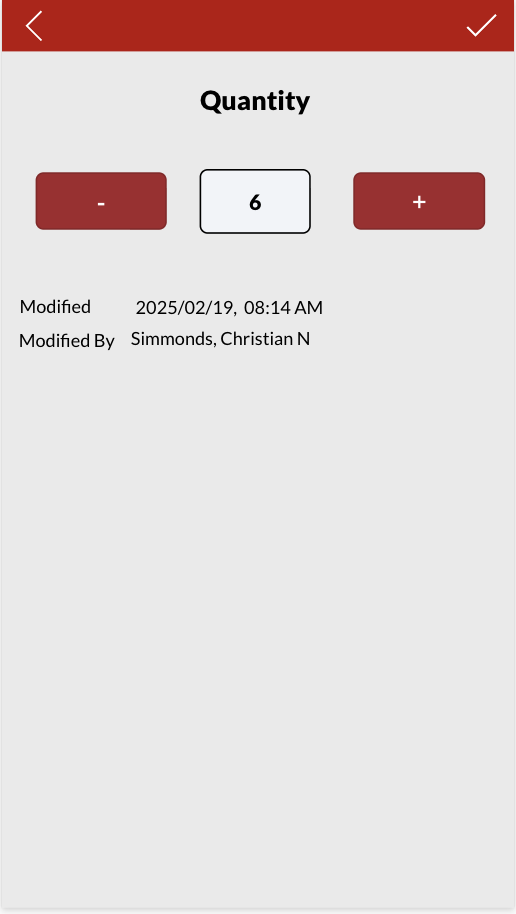

<!-- Hero / Header -->

  

<h1 align="center">NSMIT 3D Printing Inventory App</h1>

  <em>Mobile-first inventory for makerspaces - fast, visual, auditable.</em>

  
  
  
  

<!-- Quick Nav -->

  <a href="#overview">Overview</a> • 
  <a href="#features">Features</a> • 
  <a href="#screens">Screens</a> • 
  <a href="#tech-stack">Tech Stack</a> • 
  <a href="#how-it-works">How It Works</a> • 
  <a href="#deployment">Deployment</a> • 
  <a href="#credits">Credits</a>

---

## Overview
The **NSMIT 3D Printing Inventory App** is a custom, mobile-friendly SaaS built with **Microsoft Power Apps (modern FX)**, backed by **SharePoint Lists** and integrated with **Microsoft 365** and **Azure**. It replaces error-prone manual entry with a **touch-optimized interface**, **instant cloud syncing**, and **auditable change history** - perfect for a university makerspace or technical department.

> **Use case**: Track filaments (by brand and color) and equipment/parts (extruders, beds, etc.) with search, quick +/– updates, and a clean success flow.

---

## ✨ Features
- **Automated Inventory Tracking**  
  Real-time updates across devices; reduce manual errors and duplicate entry.

- **Visual, Intuitive Interface**  
  Real photos, tiles, clear labels — approachable for both technical and non-technical users.

- **Smart Search & Filters**  
  Find anything in seconds, even in large catalogs.

- **Auditable Change History**   
  Each change logs timestamp and username for accountability.

- **Mobile-First Experience**  
  Large touch targets, optimized flows, easy for staff on the floor.

- **Easy Extension**  
  Add materials/colors/equipment via SharePoint — no app redeploy needed.

---

## 🖼️ Screens 

<table>
  <tr>
    <td align="center">
       
      <strong>Home</strong> 
      Jump to <em>Materials</em> or <em>Equipment</em> with large, accessible tiles.
    </td>
    <td align="center">
       
      <strong>Materials List</strong> 
      Searchable grid of filaments with real images and manufacturers.
    </td>
  </tr>
  <tr>
    <td align="center">
       
      <strong>Color Quantities</strong> 
      Per-color stock with +/– controls and direct edit; instant SharePoint sync.
    </td>
    <td align="center">
       
      <strong>Equipment</strong> 
      Parts/accessories with photos, models, and quick search.
    </td>
  </tr>
  <tr>
    <td align="center">
       
      <strong>Edit Stock</strong> 
      Precise updates + timestamp & last editor for auditability.
    </td>
    <td align="center">
       
      <strong>Success</strong> 
      Clear cloud-save confirmation and shortcut navigation.
    </td>
  </tr>
</table>

---

## ⚙️ Tech Stack 
- **Front-End:** Microsoft **Power Apps (modern FX)** — responsive, touch-friendly UI  
- **Back-End:** **SharePoint Lists** (“Materials”, “Equipment”) — cloud datastore  
- **Auth:** **Microsoft 365** — secure, **role-based** access  
- **Cloud Sync:** **Azure Services** — reliable storage & realtime updates  
- **Automation:** Quantity updates, success toasts, logs (timestamp + user)  
- **Accessibility:** Desktop + mobile ready

---

## 🧭 How It Works 

### Flow at a Glance
1. **Home** → choose **Materials** or **Equipment**  
2. **List View** → search/filter; select an item  
3. **Detail** → adjust quantity via **+/–** or direct entry  
4. **Save** → instant **SharePoint** sync + **Success** confirmation  
5. **Audit** → each change logs **who**, **when**, and **what** changed

<strong>Data Model</strong> (click to expand)

**SharePoint: Materials**  
- `Title` (text) — Material/brand  
- `ImageUrl` (hyperlink) — Photo  
- `Manufacturer` (text)  
- `Colors` (lookup or related list)  

**SharePoint: MaterialColors**  
- `MaterialId` (lookup → Materials)  
- `ColorName` (text)  
- `Quantity` (number)  

**SharePoint: Equipment**  
- `Title` (text) — Part/accessory  
- `ModelOrSize` (text)  
- `ImageUrl` (hyperlink)  
- `Quantity` (number)

**SharePoint: ChangeLog** (optional advanced)  
- `EntityType` (choice: Material, Color, Equipment)  
- `EntityId` (text/guid)  
- `Field` (text)  
- `OldValue` / `NewValue` (text/number)  
- `ChangedBy` (person)  
- `ChangedAt` (datetime)

---

## 🚀 Deployment 

1. **Provision SharePoint Lists** (as defined above).  
2. **Build the Power App (Modern FX)** with Materials/Equipment galleries and quantity edit screens.  
3. **Configure Microsoft 365 Auth** and permissions.  
4. (Optional) **Wire Azure Services / Power Automate** for telemetry and advanced automation.  
5. **Brand & Test** for accessibility and mobile.  
6. **Publish & Share** to the appropriate security groups.

---

## 📅 Project Info
- **Created by:** *Waseem Sayyedahmad*  
- **Timeline:** *01/17/2025 – 02/20/2025*  
- **Institutional Branding:** University of Houston
