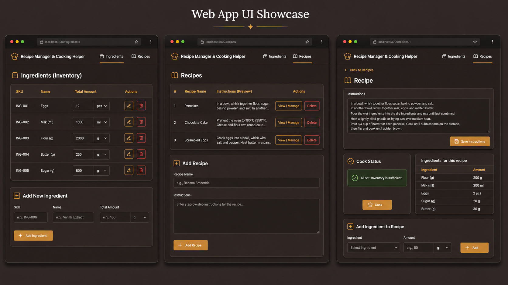
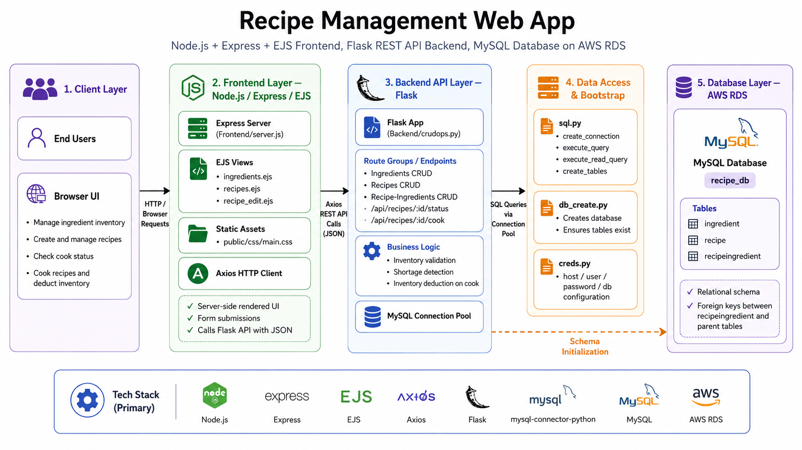
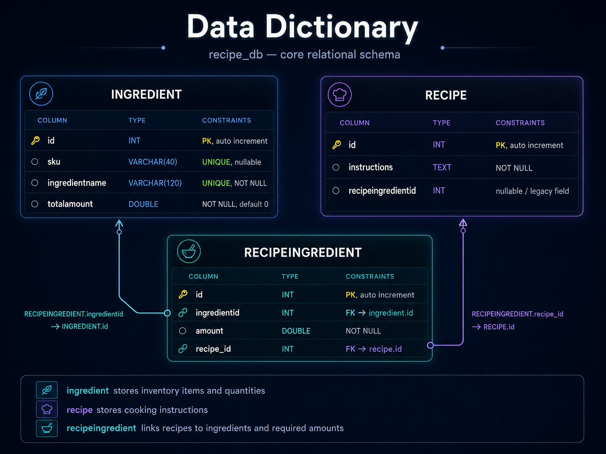

<div align="center">

# 🍳 Recipe Management Web App

### A full-stack web application for inventory-aware recipe management and cooking workflows

<p>
  
  
  
  
  
  
</p>

<p>
  <strong>Manage ingredients, build recipes, validate inventory availability, and cook with automatic stock deduction.</strong>
</p>

</div>

---

## 📌 Table of Contents

- [Project Overview](#-project-overview)
- [Web App Preview](#-web-app-preview)
- [Technical Architecture](#-technical-architecture)
- [Technology Stack](#-technology-stack)
- [Core Features](#-core-features)
- [How the System Works](#-how-the-system-works)
- [Database Design](#-database-design)
- [Project Structure](#-project-structure)
- [REST API Reference](#-rest-api-reference)
- [Getting Started](#-getting-started)
- [Configuration Notes](#-configuration-notes)
- [Example Workflow](#-example-workflow)
- [Engineering Highlights](#-engineering-highlights)
- [Known Limitations](#-known-limitations)
- [Future Enhancements](#-future-enhancements)

---

## 🧾 Project Overview

The **Recipe Management Web App** is a multi-tier full-stack application built to help users manage an ingredient inventory and create recipes that can be validated against available stock before cooking.

This project combines:

- a **Node.js + Express + EJS** front end for server-rendered UI,
- a **Flask REST API** back end for business logic and CRUD operations,
- and a **MySQL database** (configured for **AWS RDS**) for persistent storage.

At its core, the app supports an important business workflow:

> A recipe can only be cooked if sufficient ingredient inventory exists. Once the recipe is cooked, the required ingredient amounts are automatically deducted from stock.

This makes the project a solid example of:

- full-stack architecture,
- API-driven frontend/backend communication,
- relational data modeling,
- business-rule validation,
- and inventory-aware transaction logic.

---

## 🖼️ Web App Preview

<p align="center">
  
</p>

### Included UI flows

<table>
  <tr>
    <td width="33%"><strong>🥚 Ingredient Inventory</strong></td>
    <td width="33%"><strong>📖 Recipe Management</strong></td>
    <td width="33%"><strong>🍽️ Cooking Workflow</strong></td>
  </tr>
  <tr>
    <td>Create, update, and remove ingredients while tracking available quantities and optional SKU identifiers.</td>
    <td>Create recipes, edit instructions, and manage recipe-level ingredient requirements.</td>
    <td>Check whether a recipe can be cooked and deduct ingredient quantities automatically after cooking.</td>
  </tr>
</table>

---

## 🏗️ Technical Architecture

<p align="center">
  
</p>

### Architecture summary

The application follows a **separated front-end / back-end / database** architecture:

1. **Client Layer**
   - Users interact through a browser.
   - The UI allows inventory management, recipe creation, recipe inspection, cook-status checking, and cooking execution.

2. **Frontend Layer (Node.js / Express / EJS)**
   - `Frontend/server.js` serves the web application.
   - EJS templates render the user-facing pages.
   - CSS in `public/css/main.css` provides the UI styling.
   - `axios` is used by the frontend to call the Flask REST API.

3. **Backend API Layer (Flask)**
   - `Backend/crudops.py` exposes REST endpoints.
   - Business logic validates inventory sufficiency.
   - The cooking action updates stock in the database.
   - A MySQL connection pool improves backend reliability and request handling.

4. **Data Access & Bootstrap Layer**
   - `sql.py` contains database helper functions.
   - `db_create.py` initializes the database and ensures the schema exists.
   - `creds.py` stores connection parameters used by the backend.

5. **Database Layer (MySQL / AWS RDS)**
   - Database name: `recipe_db`
   - Core tables: `ingredient`, `recipe`, `recipeingredient`

---

## 🧰 Technology Stack

| Layer | Technologies | Purpose |
|---|---|---|
| Frontend | Node.js, Express, EJS, Axios | Server-rendered web UI and API communication |
| Styling | CSS | Responsive visual design for the web application |
| Backend | Python, Flask | REST API, CRUD endpoints, business logic |
| Database Connectivity | mysql-connector-python, MySQL Connection Pool | Database access and connection management |
| Database | MySQL | Stores ingredients, recipes, and recipe-ingredient mappings |
| Infrastructure | AWS RDS | Managed MySQL hosting target used by the project |
| Schema Bootstrap | `db_create.py`, `sql.py` | Database creation and table initialization |

---

## ✨ Core Features

<table>
  <tr>
    <td width="50%" valign="top">
      <h3>📦 Inventory Management</h3>
      <ul>
        <li>Create ingredients with optional SKU values</li>
        <li>Track available stock using <code>totalamount</code></li>
        <li>Update names, SKU values, and quantities</li>
        <li>Delete ingredient records</li>
      </ul>
    </td>
    <td width="50%" valign="top">
      <h3>📝 Recipe Management</h3>
      <ul>
        <li>Create recipes with text-based cooking instructions</li>
        <li>Edit instructions for existing recipes</li>
        <li>Delete recipes</li>
        <li>Associate ingredients with recipes using required amounts</li>
      </ul>
    </td>
  </tr>
  <tr>
    <td width="50%" valign="top">
      <h3>🔗 Recipe-Ingredient Linking</h3>
      <ul>
        <li>Maintain many line items through a junction table</li>
        <li>Store the quantity of each ingredient required per recipe</li>
        <li>Retrieve recipe detail with ingredient breakdown</li>
      </ul>
    </td>
    <td width="50%" valign="top">
      <h3>🍳 Cook Validation & Inventory Deduction</h3>
      <ul>
        <li>Check whether all required ingredients are available</li>
        <li>Return shortages when stock is insufficient</li>
        <li>Allow cooking only when the recipe can be fulfilled</li>
        <li>Automatically deduct stock after a successful cook action</li>
      </ul>
    </td>
  </tr>
</table>

---

## 🔄 How the System Works

### End-to-end flow

```text
Browser UI
   → Express + EJS frontend
      → Axios JSON request
         → Flask REST API
            → MySQL connection pool
               → MySQL / AWS RDS
```

### Business workflow

1. **Add ingredient inventory**
   - Users define ingredients such as eggs, milk, flour, or sugar.
   - Each ingredient can include a SKU and a tracked stock amount.

2. **Create a recipe**
   - A recipe stores cooking instructions.

3. **Attach ingredient requirements to the recipe**
   - Each required ingredient is added through the `recipeingredient` table with an amount.

4. **Check recipe status**
   - The backend compares the required amounts against current inventory.
   - If shortages exist, the API returns a list of missing or insufficient ingredients.

5. **Cook the recipe**
   - When inventory is sufficient, the backend deducts the required amounts from the ingredient inventory.

---

## 🗃️ Database Design

<p align="center">
  
</p>

### Table summary

| Table | Purpose | Key Columns |
|---|---|---|
| `ingredient` | Stores ingredient inventory data | `id`, `sku`, `ingredientname`, `totalamount` |
| `recipe` | Stores recipe instructions | `id`, `instructions`, `recipeingredientid` |
| `recipeingredient` | Junction table linking recipes and ingredients with required quantities | `id`, `ingredientid`, `amount`, `recipe_id` |

### Relationship overview

- One **recipe** can have many **recipeingredient** rows.
- One **ingredient** can appear in many **recipeingredient** rows.
- `recipeingredient` is the bridge that connects recipes to ingredients and records the required amount for each ingredient.

### Dictionary details

#### `ingredient`

| Column | Type | Notes |
|---|---|---|
| `id` | `INT` | Primary key, auto increment |
| `sku` | `VARCHAR(40)` | Optional unique identifier |
| `ingredientname` | `VARCHAR(120)` | Unique ingredient name |
| `totalamount` | `DOUBLE` | Available inventory quantity |

#### `recipe`

| Column | Type | Notes |
|---|---|---|
| `id` | `INT` | Primary key, auto increment |
| `instructions` | `TEXT` | Recipe instructions |
| `recipeingredientid` | `INT` | Present in schema, effectively a legacy/unused field |

#### `recipeingredient`

| Column | Type | Notes |
|---|---|---|
| `id` | `INT` | Primary key, auto increment |
| `ingredientid` | `INT` | Foreign key to `ingredient.id` |
| `amount` | `DOUBLE` | Quantity required for the recipe |
| `recipe_id` | `INT` | Foreign key to `recipe.id` |

---

## 📁 Project Structure

```bash
Recipe_Management_WebApp/
├── Backend/
│   ├── creds.py
│   ├── create_database_and_tables.sql
│   ├── crudops.py
│   ├── db_create.py
│   ├── requirements.txt
│   └── sql.py
└── Frontend/
    ├── package.json
    ├── package-lock.json
    ├── server.js
    ├── public/
    │   └── css/
    │       └── main.css
    └── views/
        ├── ingredients.ejs
        ├── recipe_edit.ejs
        ├── recipes.ejs
        └── partials/
            ├── footer.ejs
            └── header.ejs
```

### Key files explained

| File | Responsibility |
|---|---|
| `Backend/crudops.py` | Main Flask application and API routes |
| `Backend/sql.py` | Reusable database helper functions |
| `Backend/db_create.py` | Creates the database and ensures all required tables exist |
| `Backend/creds.py` | Stores database connection configuration |
| `Frontend/server.js` | Express application that renders EJS pages and calls the API |
| `Frontend/views/*.ejs` | User-facing page templates |
| `Frontend/public/css/main.css` | Main UI styling |

---

## 🔌 REST API Reference

### Ingredients

| Method | Endpoint | Description |
|---|---|---|
| `GET` | `/api/ingredients` | List all ingredients |
| `POST` | `/api/ingredients` | Create a new ingredient |
| `GET` | `/api/ingredients/<id>` | Retrieve one ingredient |
| `PUT` | `/api/ingredients/<id>` | Update ingredient details |
| `DELETE` | `/api/ingredients/<id>` | Delete an ingredient |

### Recipes

| Method | Endpoint | Description |
|---|---|---|
| `GET` | `/api/recipes` | List all recipes |
| `POST` | `/api/recipes` | Create a new recipe |
| `GET` | `/api/recipes/<id>` | Retrieve a recipe with its items |
| `PUT` | `/api/recipes/<id>` | Update recipe instructions |
| `DELETE` | `/api/recipes/<id>` | Delete a recipe and its line items |

### Recipe-Ingredient Line Items

| Method | Endpoint | Description |
|---|---|---|
| `GET` | `/api/recipe-ingredients` | List all recipe ingredient line items |
| `POST` | `/api/recipe-ingredients` | Create a new recipe-ingredient link |
| `GET` | `/api/recipe-ingredients/<id>` | Retrieve a single line item |
| `PUT` | `/api/recipe-ingredients/<id>` | Update a line item |
| `DELETE` | `/api/recipe-ingredients/<id>` | Delete a line item |

### Cooking / Validation

| Method | Endpoint | Description |
|---|---|---|
| `GET` | `/api/recipes/<id>/status` | Check whether a recipe can be cooked |
| `POST` | `/api/recipes/<id>/cook` | Cook a recipe and deduct inventory |

---

## 🚀 Getting Started

### Prerequisites

Before running the project, make sure you have:

- **Python 3.x**
- **Node.js + npm**
- **MySQL** or an accessible **AWS RDS MySQL** instance
- Optional: **MySQL Workbench** or another SQL client

---

### 1) Backend setup

```bash
cd Backend
python3 -m venv .venv
source .venv/bin/activate        # macOS / Linux
# .venv\Scripts\activate        # Windows
pip install -r requirements.txt
```

### 2) Configure database connection

Update `Backend/creds.py` with your own database connection settings.

> **Important:** The current codebase reads directly from `creds.py`. For real deployments, environment variables or a secrets manager should be used instead.

Example structure:

```python
class Creds:
    def __init__(self):
        self.conString = "your-hostname"
        self.userName = "your-username"
        self.password = "your-password"
        self.dbName = "recipe_db"
```

### 3) Initialize the database

```bash
python db_create.py
```

This step:
- creates the database if it does not exist,
- and ensures the necessary tables are created.

### 4) Start the backend API

```bash
python crudops.py
```

Expected backend URL:

```text
http://127.0.0.1:5000
```

---

### 5) Frontend setup

```bash
cd ../Frontend
npm install
```

### 6) Start the frontend server

```bash
npm run dev
```

Expected frontend URL:

```text
http://127.0.0.1:3000
```

Open the app in your browser and begin by navigating to the **Ingredients** page.

---

## ⚙️ Configuration Notes

### Current implementation details

- The frontend expects the backend API at:

```text
http://127.0.0.1:5000
```

- In `Frontend/server.js`, the API base can also be overridden using:

```bash
API_BASE=http://127.0.0.1:5000 npm run dev
```

### AWS RDS note

If you are using **AWS RDS**:

- ensure the database instance is running,
- ensure the security group allows inbound MySQL access from the machine running the backend,
- and confirm the configured database user has permission to create/use the `recipe_db` schema.

### Security recommendation

This repository currently stores connection parameters inside `creds.py`. For production-quality deployments, the recommended approach is to move credentials into:

- environment variables,
- a `.env` file,
- or a cloud secret-management service.

---

## 🧪 Example Workflow

Here is a practical usage example:

1. Add the following ingredients:
   - Eggs → `12`
   - Milk (ml) → `1000`
   - Flour (g) → `1500`
   - Butter (g) → `250`

2. Create a recipe with instructions for pancakes.

3. Add recipe ingredient requirements:
   - Eggs → `2`
   - Milk (ml) → `300`
   - Flour (g) → `200`
   - Butter (g) → `30`

4. Check the recipe status.
   - If all ingredients are available, the app shows that the recipe can be cooked.

5. Click **Cook**.
   - The backend deducts the required ingredient amounts from inventory.

This demonstrates the central value of the project: **inventory-aware cooking operations**.

---

## 🧠 Engineering Highlights

### Why this project stands out

- **Clear separation of concerns**
  - Frontend handles presentation.
  - Backend handles business rules.
  - Database handles persistence.

- **Connection pooling in the backend**
  - Improves reliability and scalability compared to a single long-lived connection.

- **Readable modular backend design**
  - SQL helpers are abstracted into `sql.py`.
  - Schema initialization is separated into `db_create.py`.

- **Practical business logic**
  - The app does more than CRUD by validating stock sufficiency and performing inventory deduction.

- **User-oriented UI behavior**
  - Primary keys are hidden from the interface.
  - The user works with understandable names and optional SKU values.

---

## ⚠️ Known Limitations

- Credentials are currently stored in a Python file rather than an environment-based secret system.
- There is no user authentication or authorization layer.
- The app does not yet include automated tests.
- No Docker, CI/CD, or production deployment configuration is included.
- The `recipe` table contains a `recipeingredientid` field that is present but not central to the active recipe-to-ingredient relationship logic.
- The interface is functional and clean, but could be expanded further with richer dashboards, metrics, or search/filtering.

---

## 🌱 Future Enhancements

Potential next steps for the project include:

- user authentication and role-based access,
- environment-variable based secrets management,
- Dockerization for local development and deployment,
- better validation and error messaging in the UI,
- image uploads for recipes,
- search, sorting, and filtering,
- unit and integration tests,
- recipe categories and tags,
- shopping list generation,
- and deployment automation with CI/CD.

---

<div align="center">

### ✅ Summary

This project is a strong example of a **full-stack CRUD application enhanced by real business logic**. It demonstrates database design, API architecture, server-rendered UI development, and inventory-aware workflow automation in one cohesive solution.

If you are reviewing this repository for learning, coursework, or portfolio purposes, the biggest strengths are the **end-to-end architecture**, **working relational model**, and **inventory-driven cook logic**.

</div>
