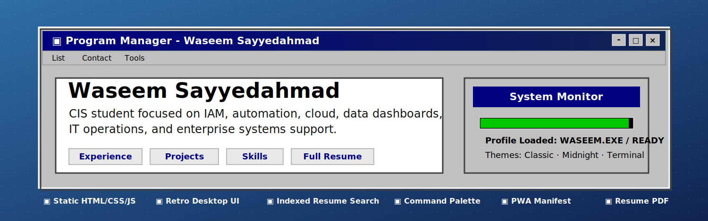
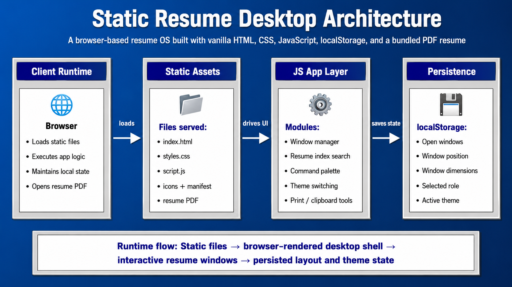
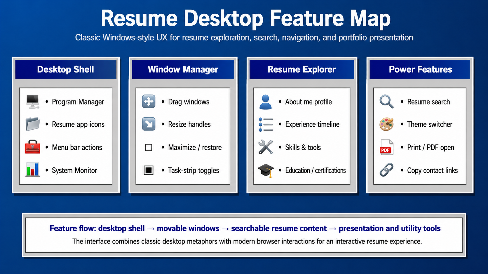
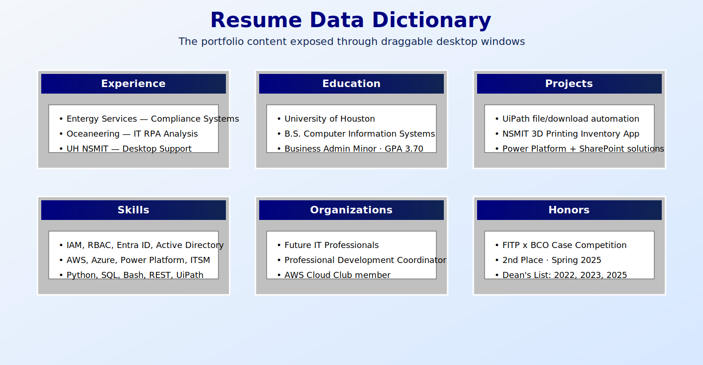

<div align="center">



# 🖥️ Waseem Static Resume WebApp

### A retro desktop-style interactive resume built with vanilla HTML, CSS, and JavaScript.

<p>
  
  
  
  
  
</p>

<p>
  <strong>An interactive portfolio-resume experience designed like a classic Windows desktop operating system.</strong>
</p>

</div>

---

## 📌 Table of Contents

- [Project Overview](#-project-overview)
- [Visual Identity](#-visual-identity)
- [Architecture](#-architecture)
- [Feature Map](#-feature-map)
- [Resume Content Map](#-resume-content-map)
- [Technology Stack](#-technology-stack)
- [Core Features](#-core-features)
- [User Experience](#-user-experience)
- [Project Structure](#-project-structure)
- [Getting Started](#-getting-started)
- [Keyboard Shortcuts](#-keyboard-shortcuts)
- [Customization Guide](#-customization-guide)
- [Deployment](#-deployment)
- [Accessibility & UX Notes](#-accessibility--ux-notes)
- [Known Limitations](#-known-limitations)
- [Future Enhancements](#-future-enhancements)

---

## 🧾 Project Overview

**Waseem Static Resume WebApp** is a browser-based interactive resume that turns a traditional PDF resume into a desktop operating-system experience. Instead of presenting a plain one-page resume, this project uses a retro **Program Manager** interface with draggable windows, a task strip, a command palette, search, themes, and resume sections organized like desktop applications.

The app is fully static and runs entirely in the browser. It does not require a backend, database, package manager, build step, or server-side framework.

The project is ideal for:

- portfolio presentation,
- resume storytelling,
- static-site hosting,
- front-end UI/UX demonstration,
- and showing strong vanilla JavaScript interaction design.

---

## 🎨 Visual Identity

The design intentionally uses a classic Windows-inspired visual system:

| Design Element | Implementation |
|---|---|
| Desktop background | blue OS-style workspace using `#2f6da5` |
| Window chrome | gray beveled panels using `#c0c0c0` |
| Active title bars | deep navy system blue using `#000080` |
| Typography | Tahoma / MS Sans Serif / Arial fallback stack |
| Interactions | desktop icons, menus, task strip, draggable windows, resize handles |
| Theme variants | Classic, Midnight, and Terminal modes |

### Primary color palette

| Token | Color | Usage |
|---|---|---|
| Desktop Blue | `#2f6da5` | desktop background |
| Window Gray | `#c0c0c0` | window shells, menus, taskbar |
| System Navy | `#000080` | title bars and active controls |
| Shadow Dark | `#404040` | bevel depth and borders |
| Shadow Light | `#ffffff` | raised edge highlights |
| Tag Gray | `#e8e8e8` | badges and skill tags |

---

## 🏗️ Architecture

<p align="center">
  
</p>

This application follows a lightweight static architecture:

```text
Browser
  ↓
index.html
  ↓
styles.css + script.js
  ↓
Interactive desktop resume shell
  ↓
localStorage state persistence + bundled PDF resume
```

### Architecture summary

1. **Client Runtime**
   - The browser loads all project files directly.
   - No backend service is required.
   - Resume windows, modals, menus, and tasks are controlled client-side.

2. **Static Assets**
   - `index.html` defines the resume content and semantic structure.
   - `styles.css` implements the retro desktop operating-system visual design.
   - `script.js` powers interaction, state, search, command palette, and window management.
   - `site.webmanifest` and icons support installable web-app behavior.
   - `Waseem_Sayyedahmad_resume.pdf` provides a downloadable/openable resume document.

3. **JavaScript App Layer**
   - Builds a searchable index from resume windows.
   - Manages draggable, resizable, and maximizable windows.
   - Stores user layout and theme preferences.
   - Provides keyboard shortcuts and command workflows.

4. **Persistence Layer**
   - Uses browser `localStorage` to remember layout, theme, open windows, selected role, and UI state.

---

## 🧭 Feature Map

<p align="center">
  
</p>

The app is structured like a small resume operating system:

- **Program Manager shell** for launching resume sections.
- **Desktop icon behavior** for minimizing and restoring the main program window.
- **Individual resume windows** for My Info, Experience, Education, Projects, Organizations, Honors, Skills, and Full Resume.
- **Search and command tools** for fast navigation.
- **Task strip** for switching between open windows.
- **Themes** for alternate visual modes.

---

## 🗂️ Resume Content Map

<p align="center">
  
</p>

The resume content is separated into focused windows, making the portfolio easier to scan than a traditional single-page resume.

| Window | Purpose | Highlighted Content |
|---|---|---|
| My Info | Profile overview and contact links | summary, email, phone, LinkedIn, GitHub |
| Experience | Work history | Entergy, Oceaneering, UH NSMIT |
| Education | Academic background | University of Houston, CIS, Business Administration Minor, GPA, coursework |
| Projects | Portfolio project details | UiPath automation, NSMIT 3D Printing Inventory App |
| Organizations | Student involvement | FITP, AWS Cloud Club |
| Honors | Awards and recognition | Case competition, Dean's List |
| Skills | Technical skill matrix | IAM, cloud, ITSM, scripting, network diagnostics, languages |
| Full Resume | Complete resume view | printable / copyable / PDF-linked resume |

---

## 🧰 Technology Stack

| Area | Technology | Role |
|---|---|---|
| Markup | HTML5 | Defines resume sections, windows, menus, modals, and content structure |
| Styling | CSS3 | Implements retro OS visuals, responsive behavior, themes, and print styling |
| Interactivity | Vanilla JavaScript | Window manager, state persistence, search, shortcuts, command palette |
| Storage | `localStorage` | Saves theme, layout, selected role, and open-window state |
| Resume Document | PDF | Provides the original downloadable/openable resume file |
| App Metadata | Web Manifest | Enables standalone-style install metadata and icons |
| Hosting Model | Static Site | Can run from a file, local server, GitHub Pages, Netlify, Vercel, or any static host |

---

## ✨ Core Features

<table>
  <tr>
    <td width="50%" valign="top">
      <h3>🖥️ Retro Desktop Shell</h3>
      <ul>
        <li>Classic Program Manager-style interface</li>
        <li>Desktop icon for restoring the main shell</li>
        <li>Menu bar with List, Contact, and Tools dropdowns</li>
        <li>System Monitor panel with clock, resume stats, and animated network bars</li>
      </ul>
    </td>
    <td width="50%" valign="top">
      <h3>🪟 Advanced Window System</h3>
      <ul>
        <li>Open, close, minimize, maximize, and restore windows</li>
        <li>Draggable title bars</li>
        <li>Resizable floating windows</li>
        <li>Z-index focus handling</li>
        <li>Task strip for switching between open windows</li>
      </ul>
    </td>
  </tr>
  <tr>
    <td width="50%" valign="top">
      <h3>🔎 Search & Navigation</h3>
      <ul>
        <li>Quick search from the main desktop panel</li>
        <li>Global indexed resume search modal</li>
        <li>Keyword scoring across resume sections</li>
        <li>Search snippets with highlighted matches</li>
        <li>Command palette for fast actions</li>
      </ul>
    </td>
    <td width="50%" valign="top">
      <h3>🧰 Portfolio Tools</h3>
      <ul>
        <li>Open all windows</li>
        <li>Minimize all windows</li>
        <li>Reset layout</li>
        <li>Toggle theme</li>
        <li>Print / save PDF</li>
        <li>Copy profile summary to clipboard</li>
      </ul>
    </td>
  </tr>
</table>

---

## 🧑‍💻 User Experience

### Main interface

The homepage behaves like a desktop shell. Users can open resume sections as if they were desktop programs.

### Resume exploration model

Instead of scrolling through one long page, users can explore focused windows:

```text
Program Manager
├── My Info
├── Experience
├── Education
├── Projects
├── Organizations
├── Honors
├── Skills
└── Full Resume
```

### State persistence

The app remembers the user's workspace state using browser storage:

- open windows,
- minimized windows,
- window placement,
- window size,
- selected role tab,
- and active theme.

---

## 📁 Project Structure

```text
Waseem.Static.Resume.WebApp/
├── index.html
├── styles.css
├── script.js
├── site.webmanifest
├── favicon.ico
├── favicon-32x32.png
├── Waseem_Sayyedahmad_resume.pdf
└── assets/
    └── icons/
        ├── favicon-16x16.png
        ├── favicon-32x32.png
        ├── favicon-48x48.png
        ├── favicon-64x64.png
        ├── favicon-96x96.png
        ├── favicon-180x180.png
        ├── favicon-192x192.png
        ├── favicon-512x512.png
        └── waseem-pixel-avatar.png
```

### Key files explained

| File | Responsibility |
|---|---|
| `index.html` | Main content, resume windows, menu structure, modals, and resume data |
| `styles.css` | Complete visual system, classic desktop theme, responsive layout, themes, and print rules |
| `script.js` | Application behavior, window manager, search, command palette, localStorage, clock, and utilities |
| `site.webmanifest` | PWA-style metadata and install icons |
| `Waseem_Sayyedahmad_resume.pdf` | Original resume PDF linked from the app |
| `assets/icons/` | Favicons, app icons, and avatar assets |

---

## 🚀 Getting Started

### Option 1: Open directly

Because the project is fully static, you can open the file directly in your browser:

```text
index.html
```

### Option 2: Run with a local static server

Using Python:

```bash
cd Waseem.Static.Resume.WebApp
python3 -m http.server 8000
```

Then open:

```text
http://localhost:8000
```

Using Node.js:

```bash
npx serve .
```

---

## ⌨️ Keyboard Shortcuts

| Shortcut | Action |
|---|---|
| `Ctrl + K` or `Cmd + K` | Open command palette |
| `/` | Open resume search |
| `Escape` | Close top modal or dropdown |
| `Enter` inside quick search | Run resume search |

---

## 🛠️ Customization Guide

### Update resume content

Most resume content lives inside `index.html`. Update the relevant window section:

```html
<section class="window float" id="win-experience">
  ...
</section>
```

### Update colors

The primary theme values are stored as CSS variables in `styles.css`:

```css
:root {
  --desktopBlue: #2f6da5;
  --winGray: #c0c0c0;
  --winBlue: #000080;
}
```

### Add a new resume window

To add a new window:

1. Create a new window section in `index.html`.
2. Add an icon button in the Program Manager grid.
3. Add the new ID to the `WINDOW_IDS` array in `script.js`.
4. Add menu and command-palette entries if needed.

### Replace the resume PDF

Replace:

```text
Waseem_Sayyedahmad_resume.pdf
```

with a new PDF using the same filename, or update all links that reference it.

---

## 🌍 Deployment

This project can be deployed to any static host.

### GitHub Pages

1. Push the project to GitHub.
2. Go to repository **Settings**.
3. Open **Pages**.
4. Set the source to the main branch and root folder.
5. Save and wait for the deployment URL.

### Netlify

Drag and drop the project folder into Netlify, or connect the GitHub repository.

### Vercel

Import the project as a static app and deploy without a build command.

### Recommended deployment settings

| Setting | Value |
|---|---|
| Build command | none |
| Output directory | project root |
| Runtime | static |
| Required server | no |

---

## ♿ Accessibility & UX Notes

The project includes several user-experience and accessibility considerations:

- semantic sectioning for resume content,
- ARIA labels for important desktop controls,
- keyboard-accessible command palette and search interactions,
- visible focus behavior through native controls,
- meaningful button labels,
- modal controls with close actions,
- responsive layout handling for smaller screens,
- and print-friendly behavior for resume output.

---

## ⚠️ Known Limitations

- The app is static and does not include a CMS or backend admin panel.
- Resume content must be edited manually in `index.html`.
- State persistence depends on browser `localStorage` availability.
- Some browser privacy modes may restrict clipboard or localStorage behavior.
- The resume PDF must be manually replaced when updated.
- The desktop metaphor is intentionally playful and may be more complex than a traditional resume page for some users.

---

## 🌱 Future Enhancements

Potential improvements include:

- adding a theme selector dropdown,
- adding a JSON-driven resume data file,
- generating resume windows dynamically from structured data,
- adding automated tests for window and search interactions,
- adding a downloadable vCard,
- adding analytics-free visitor counters,
- adding GitHub Actions deployment,
- adding a command for exporting the current layout,
- adding a mobile-first simplified resume mode,
- and creating a backend-powered contact form.

---

<div align="center">

## ✅ Summary

**Waseem Static Resume WebApp** is a portfolio-ready interactive resume that transforms career information into a memorable desktop operating-system experience. It demonstrates strong front-end fundamentals, stateful UI behavior, accessibility-aware controls, static deployment readiness, and creative UX design.

</div>
