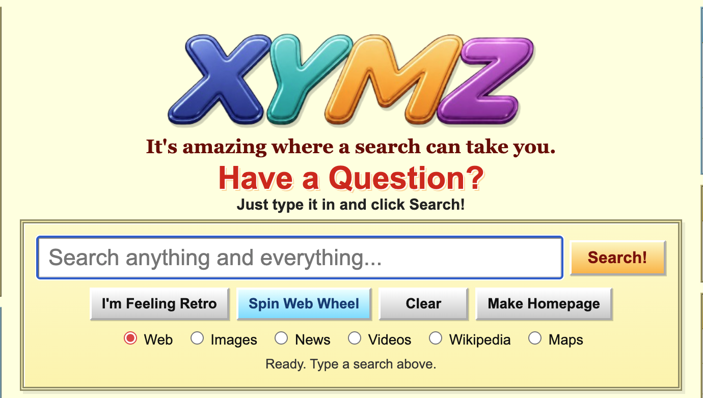
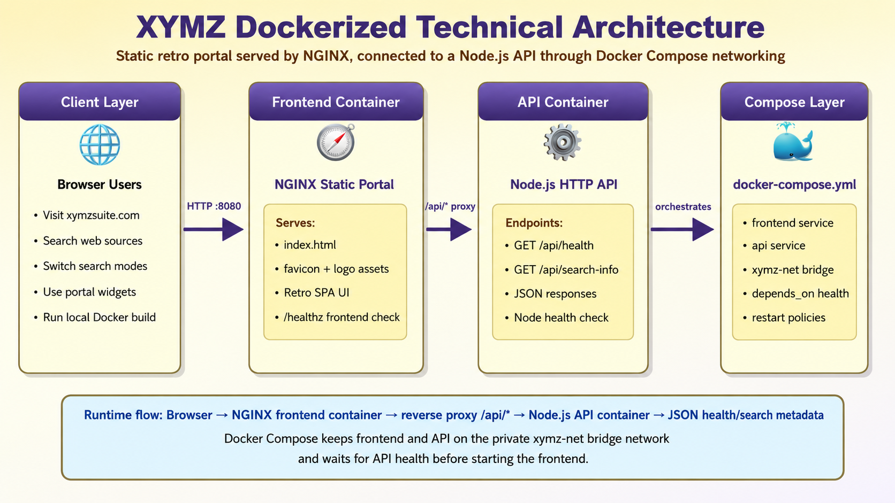
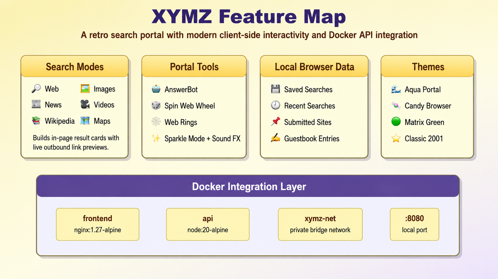

<div align="center">



# 🌐 XYMZ! Search — Dockerized Web Services Portal

### Retro search-engine experience, modern containerized delivery.

<p>
  <a href="https://www.xymzsuite.com/"></a>
  
  
  
  
</p>

<p>
  <strong>XYMZ is a nostalgic early-2000s search portal rebuilt as a Docker-ready, multi-container web application.</strong>
</p>

</div>

---

## 📌 Table of Contents

- [Project Overview](#-project-overview)
- [Live Website](#-live-website)
- [Visual Identity](#-visual-identity)
- [Technical Architecture](#-technical-architecture)
- [Feature Map](#-feature-map)
- [Technology Stack](#-technology-stack)
- [Core Features](#-core-features)
- [How the Dockerized System Works](#-how-the-dockerized-system-works)
- [Project Structure](#-project-structure)
- [API Reference](#-api-reference)
- [Getting Started](#-getting-started)
- [Docker Commands](#-docker-commands)
- [Configuration Details](#-configuration-details)
- [Troubleshooting](#-troubleshooting)
- [Engineering Highlights](#-engineering-highlights)
- [Portfolio / Resume Summary](#-portfolio--resume-summary)
- [Future Enhancements](#-future-enhancements)

---

## 🧾 Project Overview

**XYMZ! Search** is a retro-inspired search engine and web services portal with a playful early-2000s internet aesthetic. The project combines a nostalgic browser experience with practical modern engineering concepts: Docker containers, NGINX static hosting, reverse proxy routing, health checks, and an internal Docker Compose network.

The application is designed as both:

1. a **front-end web experience** with search modes, local browser features, themes, and portal widgets, and  
2. a **Docker portfolio project** that demonstrates containerized delivery of a static frontend plus a lightweight backend API.

The public website is available at:

```text
https://www.xymzsuite.com/
```

The Dockerized version runs locally at:

```text
http://localhost:8080
```

---

## 🔗 Live Website

<p align="center">
  <a href="https://www.xymzsuite.com/">
    <strong>Launch XYMZ! Search → https://www.xymzsuite.com/</strong>
  </a>
</p>

The live site presents XYMZ as a **Search Engine & Web Services** brand with:

- Web, Images, News, Videos, Wikipedia, and Maps search modes
- retro portal panels and categories
- AnswerBot
- Web Wheel
- Saved Searches
- Guestbook
- Web Buddy
- theme selector
- local browser persistence
- corporate services pages
- Help Center and About pages

---

## 🎨 Visual Identity

XYMZ intentionally uses a bold nostalgic design language inspired by classic internet portals:

| Style Element | Implementation |
|---|---|
| Retro portal layout | multi-column layout with sidebars, center search, and right-side widgets |
| Brand colors | purple, gold, cream, aqua, candy pink, and matrix green variants |
| UI texture | bevels, ridge borders, banner ads, panels, buttons, and link-heavy navigation |
| Interaction style | playful controls like “I’m Feeling Retro,” “Spin Web Wheel,” and “Summon Web Buddy” |
| Local-first behavior | saved searches, recent searches, guestbook entries, theme, and sound settings use browser storage |

### Primary color palette

| Token | Color | Usage |
|---|---|---|
| Purple | `#5b4a94` | navigation, brand panels, headings |
| Dark Purple | `#3b2a70` | header gradients, active UI states |
| Gold | `#ffd45a` | panel headers, call-to-action buttons |
| Cream | `#ffffdd` | portal background and content panels |
| Pale Yellow | `#fff6b8` | control strips and highlighted boxes |
| Aqua | `#d9f4ff` | secondary cards and Docker status styling |
| Red | `#d60000` | sponsored-link emphasis and alert accents |

---

## 🏗️ Technical Architecture

<p align="center">
  
</p>

The local Dockerized version runs as a **two-service application**:

1. **Frontend container**
   - Built from `frontend/Dockerfile`
   - Uses `nginx:1.27-alpine3.18`
   - Serves `index.html` and static assets
   - Exposes the site at `http://localhost:8080`
   - Provides a frontend health check at `/healthz`
   - Reverse proxies `/api/*` requests to the API container

2. **API container**
   - Built from `api/Dockerfile`
   - Uses `node:20-alpine`
   - Runs `api/server.js`
   - Exposes port `3000` internally
   - Provides `/api/health` and `/api/search-info`
   - Includes a Node-based Docker health check

3. **Docker Compose network**
   - `docker-compose.yml` creates a private bridge network named `xymz-net`
   - The frontend reaches the backend through Docker DNS using the service name `api`
   - Browser traffic goes to the frontend container, while internal API traffic stays inside the Compose network

---

## 🧭 Feature Map

<p align="center">
  
</p>

XYMZ combines a playful browser experience with practical web-application concepts:

- live search shortcuts
- in-page result cards
- localStorage-backed saved data
- multiple visual themes
- Docker API status checks
- reverse-proxied backend metadata
- portable local deployment

---

## 🧰 Technology Stack

| Layer | Technology | Purpose |
|---|---|---|
| Frontend UI | HTML, CSS, JavaScript | Retro single-page portal experience |
| Static Web Server | NGINX | Serves frontend files and handles `/api/*` reverse proxying |
| Backend API | Node.js HTTP server | Provides health and search metadata endpoints |
| Containerization | Docker | Builds portable frontend and API images |
| Orchestration | Docker Compose | Runs both services together |
| Networking | Docker bridge network | Enables frontend-to-API communication by service name |
| Persistence | Browser `localStorage` | Saves searches, guestbook entries, submitted sites, visitor count, theme, and sound settings |
| Deployment Target | Local Docker runtime + public static website | Supports both local demonstration and hosted brand experience |

---

## ✨ Core Features

<table>
  <tr>
    <td width="50%" valign="top">
      <h3>🔎 Search Portal</h3>
      <ul>
        <li>Search input with multiple modes</li>
        <li>Web, Images, News, Videos, Wikipedia, and Maps tabs</li>
        <li>Generated result cards with live external destinations</li>
        <li>Quick links for classic portal-style discovery</li>
      </ul>
    </td>
    <td width="50%" valign="top">
      <h3>🕹️ Retro Web Tools</h3>
      <ul>
        <li>AnswerBot helper</li>
        <li>Spin Web Wheel discovery tool</li>
        <li>Guestbook</li>
        <li>Web rings and directory-style panels</li>
      </ul>
    </td>
  </tr>
  <tr>
    <td width="50%" valign="top">
      <h3>💾 Local Browser Storage</h3>
      <ul>
        <li>Recent searches</li>
        <li>Saved searches</li>
        <li>Submitted sites</li>
        <li>Guestbook entries</li>
        <li>Theme and sound preferences</li>
      </ul>
    </td>
    <td width="50%" valign="top">
      <h3>🐳 Docker Showcase</h3>
      <ul>
        <li>Dockerfile for the NGINX frontend</li>
        <li>Dockerfile for the Node.js API</li>
        <li>Compose-managed service startup</li>
        <li>Health checks and reverse proxy routing</li>
      </ul>
    </td>
  </tr>
</table>

---

## 🔄 How the Dockerized System Works

### Request flow

```text
Browser
  ↓
http://localhost:8080
  ↓
NGINX frontend container
  ├── serves index.html and static assets
  └── proxies /api/* requests
        ↓
      api service on xymz-net
        ↓
      Node.js API container
        ↓
      JSON response returned to browser
```

### Example: API health status

When the frontend checks Docker status, the browser requests:

```text
http://localhost:8080/api/health
```

NGINX forwards that request internally to:

```text
http://api:3000/api/health
```

The API responds with JSON containing service status, container hostname, runtime version, uptime, and startup timestamp.

---

## 📁 Project Structure

```text
XYMZ!_Search_Dockerized_WebApp/
├── README.md
├── docker-compose.yml
├── frontend/
│   ├── Dockerfile
│   ├── .dockerignore
│   ├── nginx.conf
│   ├── index.html
│   └── assets/
│       ├── XYMZSearch.png
│       ├── XYMZSearch-cropped.png
│       ├── favicon.ico
│       ├── favicon.png
│       ├── favicon-16x16.png
│       ├── favicon-32x32.png
│       └── favicon-180.png
├── api/
│   ├── Dockerfile
│   ├── .dockerignore
│   ├── package.json
│   └── server.js
└── docs/
    ├── README.md
    └── docker-troubleshooting.md
```

### Key files explained

| File | Responsibility |
|---|---|
| `frontend/index.html` | Main XYMZ single-page portal, UI, JavaScript behavior, and localStorage logic |
| `frontend/nginx.conf` | NGINX static hosting, SPA fallback, `/api/*` reverse proxy, and `/healthz` endpoint |
| `frontend/Dockerfile` | Builds the NGINX-based frontend container |
| `api/server.js` | Lightweight Node.js HTTP API |
| `api/Dockerfile` | Builds the Node.js API container and defines API health check |
| `docker-compose.yml` | Defines the frontend service, API service, bridge network, ports, and health dependency |
| `docs/docker-troubleshooting.md` | Notes for common Docker health check and container-startup issues |

---

## 🔌 API Reference

### `GET /api/health`

Returns runtime and container health information.

#### Example response

```json
{
  "status": "ok",
  "service": "XYMZ Search Engine & Web Services API",
  "container": "container-hostname",
  "runtime": "Node.js v20.x.x",
  "uptimeSeconds": 42,
  "startedAt": "2026-01-01T00:00:00.000Z",
  "message": "The frontend reached this API through the Docker Compose network and NGINX reverse proxy."
}
```

### `GET /api/search-info?q=retro+web+design`

Returns simple metadata about the submitted query.

#### Example response

```json
{
  "query": "retro web design",
  "length": 16,
  "wordCount": 3,
  "tip": "Try comparing Web, News, Wikipedia, and Maps results for \"retro web design\".",
  "poweredBy": "XYMZ Docker API"
}
```

### Unknown routes

Unknown API routes return a JSON `404` response with guidance to try `/api/health` or `/api/search-info`.

---

## 🚀 Getting Started

### Prerequisites

Make sure you have:

- Docker Desktop
- Docker Compose
- Git or a ZIP extraction workflow
- A modern browser
- Optional: VS Code

---

### 1) Open the project folder

```bash
cd XYMZ!_Search_Dockerized_WebApp
```

### 2) Confirm Docker is available

```bash
docker --version
docker compose version
```

### 3) Build and start the containers

```bash
docker compose up --build
```

### 4) Open the application

```text
http://localhost:8080
```

### 5) Test the backend through the frontend reverse proxy

```text
http://localhost:8080/api/health
```

### 6) Test the query metadata endpoint

```text
http://localhost:8080/api/search-info?q=retro%20web%20design
```

### 7) Stop the project

Press `Ctrl + C`, then run:

```bash
docker compose down
```

---

## 🛠️ Docker Commands

| Task | Command |
|---|---|
| Build and run | `docker compose up --build` |
| Run in background | `docker compose up -d --build` |
| Stop containers | `docker compose down` |
| Rebuild from scratch | `docker compose build --no-cache` |
| View running services | `docker compose ps` |
| Follow all logs | `docker compose logs -f` |
| Follow frontend logs | `docker compose logs -f frontend` |
| Follow API logs | `docker compose logs -f api` |
| Enter frontend container | `docker compose exec frontend sh` |
| Enter API container | `docker compose exec api sh` |
| Remove orphans | `docker compose down --remove-orphans` |

---

## ⚙️ Configuration Details

### Docker Compose services

The project defines two services:

| Service | Build Context | Runtime | Network | Purpose |
|---|---|---|---|---|
| `frontend` | `./frontend` | NGINX Alpine | `xymz-net` | Serves the retro portal and proxies API traffic |
| `api` | `./api` | Node Alpine | `xymz-net` | Provides JSON API endpoints |

### Frontend port mapping

```yaml
ports:
  - "8080:80"
```

This maps local port `8080` to port `80` inside the NGINX container.

### Internal API exposure

```yaml
expose:
  - "3000"
```

The API does not need to be published directly to the host because NGINX reaches it over the Docker network.

### Reverse proxy behavior

```nginx
location /api/ {
  proxy_pass http://api:3000/api/;
}
```

This lets the browser use `/api/...` while Docker routes the request to the internal API service.

---

## 🧯 Troubleshooting

### API container is unhealthy

Run:

```bash
docker compose down --remove-orphans
docker compose up --build
```

Then inspect logs:

```bash
docker compose logs -f api
```

### Frontend starts but Docker Status says API offline

Check the health endpoint:

```text
http://localhost:8080/api/health
```

If it fails, verify both containers are running:

```bash
docker compose ps
```

### Port 8080 is already in use

Either stop the process using port `8080`, or change the port mapping in `docker-compose.yml`:

```yaml
ports:
  - "8081:80"
```

Then open:

```text
http://localhost:8081
```

### Old containers are conflicting

Clean up older containers and rebuild:

```bash
docker compose down --remove-orphans
docker compose build --no-cache
docker compose up
```

---

## 🧠 Engineering Highlights

### What this project demonstrates

- **Containerized frontend delivery** using NGINX
- **Backend API containerization** using Node.js on Alpine Linux
- **Reverse proxy routing** from `/api/*` to an internal service
- **Docker Compose orchestration** with multi-service startup
- **Private bridge networking** with service-name DNS resolution
- **Health checks** for both frontend and backend services
- **Local-first frontend persistence** using `localStorage`
- **Portfolio-friendly cloud/devops storytelling** around a visual web project

### Why the architecture matters

This project is intentionally simple at the app layer but strong at the deployment layer. It shows that a static site can be packaged like a production web service, fronted by NGINX, connected to an API, and managed through Docker Compose.

---

## 💼 Portfolio / Resume Summary

### Short version

> Containerized a retro search-engine portal with NGINX, Node.js, and Docker Compose; configured reverse proxy routing, health checks, and private bridge networking for frontend-to-API communication.

### Technical version

> Built a Dockerized web services showcase for XYMZ Search using an NGINX-served static frontend, a lightweight Node.js API, and Docker Compose orchestration. Configured `/api/*` reverse proxy routing, service health checks, restart policies, and an isolated Docker bridge network to demonstrate production-style container communication.

### Skills demonstrated

- Dockerfile authoring
- Docker Compose orchestration
- NGINX static hosting
- NGINX reverse proxy configuration
- Node.js API development
- Container networking
- Health check design
- Frontend localStorage workflows
- Static-site deployment readiness
- Portfolio documentation

---

## 🌱 Future Enhancements

Potential next steps:

- Add a real search aggregation API
- Add authentication for custom portal dashboards
- Store guestbook entries and submitted sites in a database
- Add a backend persistence layer such as PostgreSQL or MySQL
- Add CI/CD deployment automation
- Add unit tests for the API
- Add Playwright tests for the frontend
- Add Docker image publishing through GitHub Actions
- Add production NGINX TLS configuration
- Add observability with structured logs and metrics

---

<div align="center">

## ✅ Summary

**XYMZ! Search** is a retro-styled web portal with a modern deployment story.  
It blends playful early-web aesthetics with containerized infrastructure concepts such as NGINX reverse proxying, Docker Compose orchestration, service health checks, and internal container networking.

<br />

<strong>Live Website:</strong> <a href="https://www.xymzsuite.com/">https://www.xymzsuite.com/</a>

</div>
