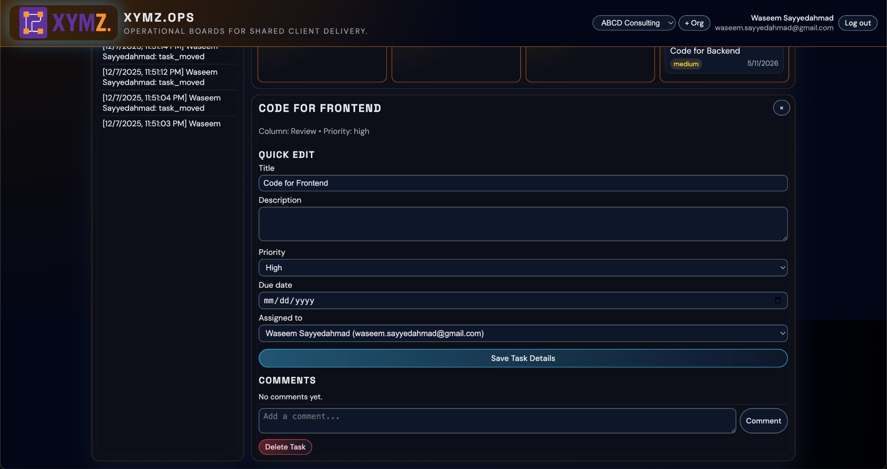

<h1 align="center">XYMZ.Suite</h1>

<p align="center">
  <strong>Shared workspaces for agencies &amp; clients – projects, insights, teams, and risk, all in one place.</strong>
</p>

<p align="center">
  
</p>

<p align="center">
  <a href="https://nodejs.org/">
    
  </a>
  <a href="https://aws.amazon.com/rds/">
    
  </a>
  <a href="https://render.com/">
    
  </a>
  <a href="https://cloudflare.com/">
    
  </a>
</p>

---

## Table of Contents

1. [Overview](#overview)  
2. [Key Features](#key-features)  
3. [System Architecture](#system-architecture)  
4. [Screenshots & UI Tour](#screenshots--ui-tour)  
5. [How the Workspace Works](#how-the-workspace-works)  
6. [Database Schema](#database-schema)  
7. [Table Summary](#table-summary)  
8. [Tech Stack](#tech-stack)  
9. [Project Structure](#project-structure)  
10. [Running the Project](#running-the-project)  
11. [Acknowledgements](#acknowledgements)  

---

## Overview

**XYMZ.Suite** is a full-stack web application that gives agencies, consultants, and small teams a shared workspace for client projects.

It combines:

- **XYMZ.Suite** – landing & overview hub  
- **XYMZ.Ops** – Kanban boards and day-to-day delivery  
- **XYMZ.BI** – simple project & task analytics  
- **XYMZ.Fleet** – team capacity and workload overview  
- **XYMZ.Radar** – risk, deadlines, and alerts  

### Deployment

- **Backend API + Static Frontend**  
  Deployed on **Render** as a Node.js service (Express). HTTPS is handled by Render with an automatically provisioned TLS certificate for the custom domain.

- **Database**  
  **MySQL** hosted on **AWS RDS**, inside a dedicated **VPC** with two subnets for high availability and network isolation.

- **Domain & DNS**  
  Custom domain **`xymzsuite.com`** purchased and managed on **Cloudflare**, with:
  - `www.xymzsuite.com` → CNAME to Render service  
  - `xymzsuite.com` → CNAME / root mapping to Render service  

---

## Key Features

<details>
  <summary><strong>Authentication & Security</strong></summary>

- Email + password authentication  
- Passwords stored as **bcrypt hashes**  
- Security question + answer stored as hashes for password recovery  
- Optional **6-digit organization token** on login to route users into the correct workspace  
- **JWT-based** session tokens on the backend  
</details>

<details>
  <summary><strong>Organizations & Workspaces</strong></summary>

- Create a new organization as an **admin**, or join an existing one via a 6-digit **join token**  
- Each user can belong to **multiple organizations**  
- Top-bar **organization switcher** to move between workspaces  
</details>

<details>
  <summary><strong>Projects & Kanban Boards (XYMZ.Ops)</strong></summary>

Per organization you can create multiple projects, each with its own Kanban board:

- Customizable **columns** (Backlog, In Progress, Review, Done, etc.)  
- **Tasks** inside columns with drag-and-drop movement  

For each task:

- Title & description  
- Priority (low / medium / high)  
- Due date  
- Assignment to a member  
- Comments thread  
- File attachments (uploaded to the backend)  
</details>

<details>
  <summary><strong>Analytics (XYMZ.BI)</strong></summary>

- Project-level **dashboard**:
  - Stacked bar chart of task statuses:
    - In Progress  
    - Review  
    - Complete  
  - Hover tooltips show owners and upcoming deadlines  

- Task-level **drilldown**:
  - Bar chart of **days left** per task  
  - Quickly see which tasks are close to their deadline  
</details>

<details>
  <summary><strong>Team Capacity (XYMZ.Fleet)</strong></summary>

- Roster of members in the current organization  
- Summary cards with:
  - Total members  
  - Active projects  
  - Average tasks per person  
- Narrative **Focus** panel that explains who may be overloaded and who has room for more work  
</details>

<details>
  <summary><strong>Delivery Risk & Alerts (XYMZ.Radar)</strong></summary>

Three panels give a one-glance health check:

- **Overdue Tasks**  
- **At-Risk Projects**  
- **Upcoming Deadlines**  

Uses due dates and task states to surface what needs immediate attention across the workspace.  
</details>

---

## System Architecture

### Frontend

- Static **HTML/CSS/JavaScript** frontend under `frontend/`  
- Single-page style interface with views controlled by tabs:
  - Auth (Login / Sign-up)  
  - XYMZ.Suite  
  - XYMZ.Ops  
  - XYMZ.BI  
  - XYMZ.Fleet  
  - XYMZ.Radar  

- Custom branding:
  - XYMZ logo  
  - Dark theme palette  
  - Clean typographic hierarchy  

- Layout inspired by modern dark SaaS dashboards:
  - Multi-panel layout  
  - Accent borders  
  - Subtle glow / neon-style focus states  

---

### Backend (Node.js + Express)

Main entry: `backend/server.js`  

Core API groups (all prefixed with `/api`):

#### Auth

- `POST /api/auth/register` – create user (+ optional organization for admins)  
- `POST /api/auth/login` – authenticate & issue JWT  
- `GET /api/auth/security-question` – fetch stored security question by email  
- `POST /api/auth/reset-password` – security-question-based password reset  
- `POST /api/auth/reset-org-token` – reset the 6-digit organization token (admin)

#### Organizations & Membership

- `GET /api/me` – current user + organizations  
- `GET /api/orgs` – list organizations the user belongs to  
- `POST /api/orgs` – create a new organization  
- `POST /api/orgs/join-token` – join an organization via 6-digit token  

#### Projects & Board

- `GET /api/orgs/:orgId/projects` – list projects in an org  
- `POST /api/orgs/:orgId/projects` – create a project  
- `DELETE /api/projects/:projectId` – delete a project (with cascade in DB)  
- `GET /api/projects/:projectId/board` – full Kanban board (columns + tasks + members)  
- `POST /api/projects/:projectId/columns` – add a new column  
- `POST /api/projects/:projectId/tasks` – create task  
- `PUT /api/tasks/:taskId` – update task fields  
- `PATCH /api/tasks/:taskId/move` – drag-and-drop movement across columns  
- `DELETE /api/tasks/:taskId` – delete task  

#### Comments & Attachments

- `GET /api/tasks/:taskId/comments` – list comments for a task  
- `POST /api/tasks/:taskId/comments` – add a comment  
- `POST /api/tasks/:taskId/attachments` – upload a file  

#### Analytics / Insights

- `GET /api/orgs/:orgId/bi-summary` – project-level BI summary  
- `GET /api/projects/:projectId/bi-tasks` – task list with days-left calculation  
- `GET /api/orgs/:orgId/activity` – recent activity feed  

*(Additional fleet/radar endpoints can be added or derived from BI + board data.)*

#### Middleware Stack

- CORS  
- JSON body parsing (`express.json`)  
- JWT auth middleware (protects application routes)  
- Multer for file uploads to `backend/uploads/`  
- Central error handler for unexpected server errors  

---

### Database

- Engine: **MySQL** (AWS RDS)  
- Database name: `taskdesk` (configurable)  
- Charset & collation: **`utf8mb4` / `utf8mb4_unicode_ci`** for full Unicode support  

**Connectivity**

- Node backend uses **mysql2** with a connection pool (`backend/db.js`)  
- Credentials and host are configured via environment variables on the Render backend service  

---

### Hosting Topology

- **Render**
  - Runs the Node.js backend  
  - Serves the frontend assets  
  - Handles HTTPS with auto TLS certificates  

- **AWS RDS**
  - MySQL inside a dedicated **VPC**  
  - Two subnets for high availability  
  - Security groups restrict access to the backend only  

- **Cloudflare**
  - Domain registration for `xymzsuite.com`  
  - DNS (CNAME) records for `xymzsuite.com` and `www`  
  - Works alongside Render’s TLS for secure browsing  

---

## Screenshots & UI Tour

> Add these images under `docs/screenshots/` and adjust paths if needed.

| Area                                        | Screenshot                                                       |
|---------------------------------------------|------------------------------------------------------------------|
| Auth – Login & Sign Up                      |  |
| XYMZ.Suite – Welcome / Landing View         |      |
| XYMZ.Ops – Kanban Board                     |           |
| Task Detail – Quick Edit & Comments         |   |
| XYMZ.BI – Project Insights                  |  |
| XYMZ.BI – Task Drilldown                    |     |
| XYMZ.Fleet – Team & Workload                |         |
| XYMZ.Radar – Risk & Alerts                  |            |

---

## How the Workspace Works

### 1. Authentication Flow

**Screenshot:** Auth – Login & Sign Up

New users can sign up with:

- Name  
- Email  
- Password (minimum 6 characters)  
- Security question + answer  
- Optional checkbox: **“I will be an admin (create an organization)”**  

Admin users automatically:

- Create their first organization  
- Define a unique 6-digit **organization token**  

Regular users can later join an existing organization using this token.

**Login requires:**

- Email  
- Password  
- Optional organization token (helps route the user into the correct workspace)  

**Links:**

- **Forgot password?** – triggers security-question-based recovery  
- **Reset 6-digit token** – issues a new organization token for admins  

---

### 2. XYMZ.Suite – Welcome Hub

**Screenshot:** XYMZ.Suite – Welcome / Landing View

**Left sidebar:**

- **Projects list** for the current organization  
- **Activity feed** with recent actions (`task_moved`, new tasks, comments, etc.)  

**Top navigation:**

- XYMZ app selector tabs:  
  - `XYMZ.Suite`, `XYMZ.Ops`, `XYMZ.BI`, `XYMZ.Fleet`, `XYMZ.Radar`  
- Organization dropdown (for example, `ABCD Consulting`)  
- User chip showing **name + email** and a **Log out** button  

**Main content:**

- Welcome text explaining how to use the suite  
- **About XYMZ** panel  
- **FAQs** panel ready for additional content  
- **Contact** panel (email & phone)  
- **Social** icons (Instagram, X, LinkedIn, Facebook)  

This page is the “home base” where users land after logging in.

---

### 3. XYMZ.Ops – Project Kanban

**Screenshots:** XYMZ.Ops – Kanban Board, Task Detail – Quick Edit & Comments

**Top section:**

- Project name (for example, `WEB APPLICATION DEPLOYMENT`)  
- Project description line  
- Actions: **+ Column**, **+ Task**, **Delete Project**  

**Board layout:**

- Each column represents a stage: **Backlog**, **In Progress**, **Review**, **Done**  
- Columns show the number of tasks in the header  
- Each task card displays:
  - Title  
  - Priority  
  - Due date  

**Interaction:**

- Clicking a task opens the **Quick Edit panel** on the right:
  - Edit title, description, priority, due date, assignee  
  - Save Task Details button  
  - Comments section:
    - Add new comments  
    - View full discussion history  
  - Delete Task button  

All column and task changes are persisted in MySQL, and actions can be mirrored in an `activity_log` table for an audit trail.

---

### 4. XYMZ.BI – Project Insights & Task Drilldown

**Screenshots:** XYMZ.BI – Project Insights, XYMZ.BI – Task Drilldown

**Top chart: PROJECT INSIGHTS**

- Stacked bar per project:
  - In Progress  
  - Review  
  - Complete  

Tooltip summaries can include:

- Completed task count  
- Owners / assignees  
- Soonest due date  

**Bottom chart: TASKS – [Project Name]**

- Bar chart showing **days left** per task  
- Quickly reveals which tasks are approaching their deadlines  

Data comes from `projects`, `tasks`, and `org_members` via aggregation queries.

---

### 5. XYMZ.Fleet – Teams & Coverage

**Screenshot:** XYMZ.Fleet – Team & Workload

**Roster panel:**

- Lists members in the selected organization  
- Shows each member’s email and task counts  

**Workload & Roles:**

- Total members  
- Active projects  
- Average tasks per person  

**Focus panel:**

- Narrative explanation of current capacity (for example, “1 member(s) are sharing 3 task(s)”)  

This view makes it easy to see whether workload is balanced or if someone is overloaded.

---

### 6. XYMZ.Radar – Alerts & Monitoring

**Screenshot:** XYMZ.Radar – Risk & Alerts

- **Overdue Tasks**  
  - Tasks past their due date across all projects  
- **At-Risk Projects**  
  - Projects with a lot of in-progress work and near-term deadlines  
- **Upcoming Deadlines**  
  - Tasks with due dates approaching soon  

Each panel summarizes counts and dates, using task `due_date` and column-based status signals.

---

## Database Schema

The database is implemented in **MySQL** with the following schema:

```sql
-- USERS
CREATE TABLE IF NOT EXISTS users (
  id INT AUTO_INCREMENT PRIMARY KEY,
  email VARCHAR(255) NOT NULL UNIQUE,
  name VARCHAR(255) NOT NULL,
  password_hash VARCHAR(255) NOT NULL,
  security_question VARCHAR(255),
  security_answer_hash VARCHAR(255),
  created_at DATETIME NOT NULL
);

-- ORGANIZATIONS
CREATE TABLE IF NOT EXISTS organizations (
  id INT AUTO_INCREMENT PRIMARY KEY,
  name VARCHAR(255) NOT NULL,
  owner_user_id INT NOT NULL,
  join_token VARCHAR(6) UNIQUE,
  created_at DATETIME NOT NULL,
  CONSTRAINT fk_org_owner
    FOREIGN KEY (owner_user_id) REFERENCES users(id)
    ON DELETE CASCADE
);

-- ORG MEMBERS
CREATE TABLE IF NOT EXISTS org_members (
  org_id INT NOT NULL,
  user_id INT NOT NULL,
  role VARCHAR(50) NOT NULL DEFAULT 'owner',
  invited_at DATETIME NOT NULL,
  PRIMARY KEY (org_id, user_id),
  CONSTRAINT fk_org_members_org
    FOREIGN KEY (org_id) REFERENCES organizations(id)
    ON DELETE CASCADE,
  CONSTRAINT fk_org_members_user
    FOREIGN KEY (user_id) REFERENCES users(id)
    ON DELETE CASCADE
);

-- PROJECTS
CREATE TABLE IF NOT EXISTS projects (
  id INT AUTO_INCREMENT PRIMARY KEY,
  org_id INT NOT NULL,
  name VARCHAR(255) NOT NULL,
  description TEXT,
  status VARCHAR(50) NOT NULL DEFAULT 'active',
  created_at DATETIME NOT NULL,
  CONSTRAINT fk_projects_org
    FOREIGN KEY (org_id) REFERENCES organizations(id)
    ON DELETE CASCADE
);

-- PROJECT COLUMNS
CREATE TABLE IF NOT EXISTS project_columns (
  id INT AUTO_INCREMENT PRIMARY KEY,
  project_id INT NOT NULL,
  name VARCHAR(255) NOT NULL,
  position INT NOT NULL,
  created_at DATETIME NOT NULL,
  CONSTRAINT fk_columns_project
    FOREIGN KEY (project_id) REFERENCES projects(id)
    ON DELETE CASCADE
);

-- TASKS
CREATE TABLE IF NOT EXISTS tasks (
  id INT AUTO_INCREMENT PRIMARY KEY,
  project_id INT NOT NULL,
  column_id INT NOT NULL,
  title VARCHAR(255) NOT NULL,
  description TEXT,
  priority VARCHAR(50) NOT NULL DEFAULT 'medium',
  position INT NOT NULL,
  due_date DATETIME NULL,
  assigned_to INT NULL,
  created_at DATETIME NOT NULL,
  CONSTRAINT fk_tasks_project
    FOREIGN KEY (project_id) REFERENCES projects(id)
    ON DELETE CASCADE,
  CONSTRAINT fk_tasks_column
    FOREIGN KEY (column_id) REFERENCES project_columns(id)
    ON DELETE CASCADE,
  CONSTRAINT fk_tasks_assigned_to
    FOREIGN KEY (assigned_to) REFERENCES users(id)
    ON DELETE SET NULL
);

-- COMMENTS
CREATE TABLE IF NOT EXISTS comments (
  id INT AUTO_INCREMENT PRIMARY KEY,
  task_id INT NOT NULL,
  user_id INT NOT NULL,
  body TEXT NOT NULL,
  created_at DATETIME NOT NULL,
  CONSTRAINT fk_comments_task
    FOREIGN KEY (task_id) REFERENCES tasks(id)
    ON DELETE CASCADE,
  CONSTRAINT fk_comments_user
    FOREIGN KEY (user_id) REFERENCES users(id)
    ON DELETE CASCADE
);

-- ACTIVITY_LOG
CREATE TABLE IF NOT EXISTS activity_log (
  id INT AUTO_INCREMENT PRIMARY KEY,
  org_id INT NOT NULL,
  user_id INT NULL,
  type VARCHAR(100) NOT NULL,
  payload_json TEXT,
  created_at DATETIME NOT NULL,
  CONSTRAINT fk_activity_org
    FOREIGN KEY (org_id) REFERENCES organizations(id)
    ON DELETE CASCADE,
  CONSTRAINT fk_activity_user
    FOREIGN KEY (user_id) REFERENCES users(id)
    ON DELETE SET NULL
);

-- ATTACHMENTS
CREATE TABLE IF NOT EXISTS attachments (
  id INT AUTO_INCREMENT PRIMARY KEY,
  task_id INT NOT NULL,
  filename VARCHAR(255) NOT NULL,
  original_name VARCHAR(255) NOT NULL,
  mime_type VARCHAR(255) NOT NULL,
  size INT NOT NULL,
  created_at DATETIME NOT NULL,
  CONSTRAINT fk_attachments_task
    FOREIGN KEY (task_id) REFERENCES tasks(id)
    ON DELETE CASCADE
);
```

---

## Table Summary

- **users** – application users with password & security-answer hashes  
- **organizations** – client workspaces; each has an owner and a 6-digit join token  
- **org_members** – many-to-many mapping between users and organizations, with roles  
- **projects** – projects within an organization  
- **project_columns** – Kanban list columns per project  
- **tasks** – individual tasks, linked to a project and column, with assignee and due date  
- **comments** – discussion thread on each task  
- **activity_log** – timeline of events across an organization  
- **attachments** – metadata for files uploaded to a task  

---

## Tech Stack

### Frontend

- **HTML5, CSS3**  
- **Vanilla JavaScript** (no heavy frontend framework required)

### Backend

- **Node.js**  
- **Express.js**  
- **JSON Web Tokens (JWT)** – auth & sessions  
- **Multer** – file uploads  
- **bcryptjs** – password hashing  

### Database

- **MySQL** (AWS RDS)  
- **mysql2** (Node client)  

### Infrastructure

- **Render** – app hosting (Node service + static files)  
- **AWS RDS** – managed MySQL  
- **Cloudflare** – domain & DNS  

---

## Project Structure

```text
XYMZ-Suite/
├── backend/
│   ├── server.js          # Express app & API routes
│   ├── db.js              # MySQL connection pool & helpers
│   ├── package.json
│   ├── package-lock.json
│   ├── uploads/           # Uploaded task attachments
│   └── .env               # Backend configuration (not committed)
├── frontend/
│   ├── index.html         # Main SPA shell
│   ├── js/
│   │   └── app.js         # Frontend logic & API calls
│   ├── css/               # Stylesheets (dark theme, layout)
│   └── img/               # Logo and other assets
└── README.md
```

---

## Running the Project

This is a simplified overview of how the app is run locally or on a new environment.

### 1. Clone the repository

```bash
git clone https://github.com/<your-username>/XYMZ-Suite.git
cd XYMZ-Suite/backend
```

### 2. Install backend dependencies

```bash
npm install
```

### 3. Create the MySQL database

- Create a new empty database (e.g., `taskdesk`) in MySQL.  
- Run the SQL from the **Database Schema** section against that database.

### 4. Configure backend environment

Create a `.env` file in `backend/` with your own values:

```env
PORT=5500
JWT_SECRET=super-secret-jwt-key

DB_HOST=your-rds-endpoint.amazonaws.com
DB_USER=your_db_user
DB_PASSWORD=your_db_password
DB_NAME=taskdesk
DB_PORT=3306
```

> Make sure `.env` is **not** committed to Git.

### 5. Start the backend

```bash
npm start
```

### 6. Open the frontend

- Serve `frontend/index.html` using a simple static server:
  - VS Code Live Server  
  - `npx http-server ./frontend`  
  - or configure Express to serve the `frontend` folder  
- Open the served URL in a browser, log in or sign up, and start using **XYMZ.Suite**.

---

## Acknowledgements

- Frontend layout and dark dashboard look inspired by modern SaaS admin templates and design patterns.  
- Infrastructure design informed by common three-tier web app practices (**Render + AWS RDS + Cloudflare**).  
- Built to illustrate a realistic full-stack workflow: auth, multi-tenant orgs, Kanban boards, analytics, and simple DevOps on a student-friendly stack.
